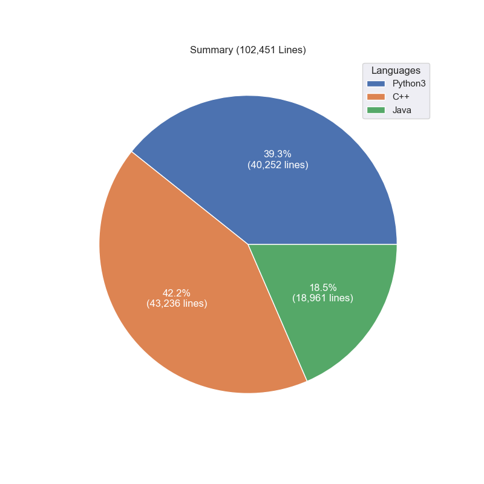

# [LeetCode](https://leetcode.com/)

This repository contains my solutions of some Leetcode algorithm questions.
Currently it contains Python3 solution for 1165 problems, C++ solution for 1076 problems, Java solution for 785 problems.
A problem may have multiple solutions.

The solutions cover a lot of frequent used algorithms including recursion, backtrack, dynamic programming, greedy algorithm and graph (e.g. tree) algorithms etc.

* [Python 3](python3.md)
* [C++](cpp.md)
* [Java](java.md)

Language statistics

